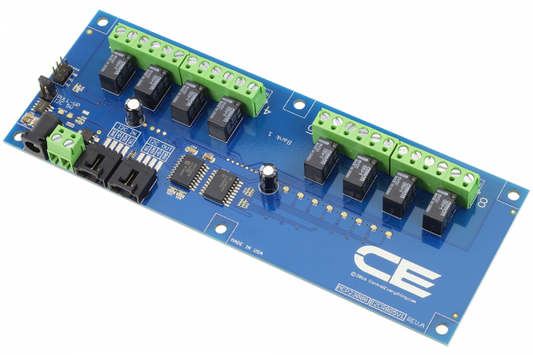

[](https://store.ncd.io/product/8-channel-1-amp-spdt-signal-relay-controller-with-i2c-interface/).

#  MCP23008

This IoT 8-channel low-power signal relay controller is capable of hosting many types of IoT communication modules, including Particle Photon, Electron, Arduino, and more.  On-board SPDT relays are ideally suited for low-power signal switching applications, up to 1 Amp at 12VDC.  This Device is available from www.ncd.io 

[SKU: MCP23008]

(https://store.ncd.io/product/8-channel-1-amp-spdt-signal-relay-controller-with-i2c-interface/)
This Sample code can be used with Raspberry Pi.

Hardware needed to interface MCP23008 8-Channel Relay Driver With Raspberry Pi :
1. <a href="https://store.ncd.io/product/8-channel-1-amp-spdt-signal-relay-controller-with-i2c-interface/">MCP23008 8-Channel 1-Amp SPDT Signal Relay Controller</a>
2.  <a href="https://store.ncd.io/product/i2c-shield-for-raspberry-pi-3-pi2-with-outward-facing-i2c-port-terminates-over-hdmi-port/">Raspberry Pi I2C Shield</a>
3. <a href="https://store.ncd.io/product/i%C2%B2c-cable/">I2C Cable</a>

## Python
Download and install smbus library on Raspberry pi. Steps to install smbus are provided at:

https://pypi.python.org/pypi/smbus-cffi/0.5.1

Download (or git pull) the code in pi. Run the program.

```cpp
$> python MCP23008.py
```
The lib is a sample library, you will need to calibrate the sensor according to your application requirement.
